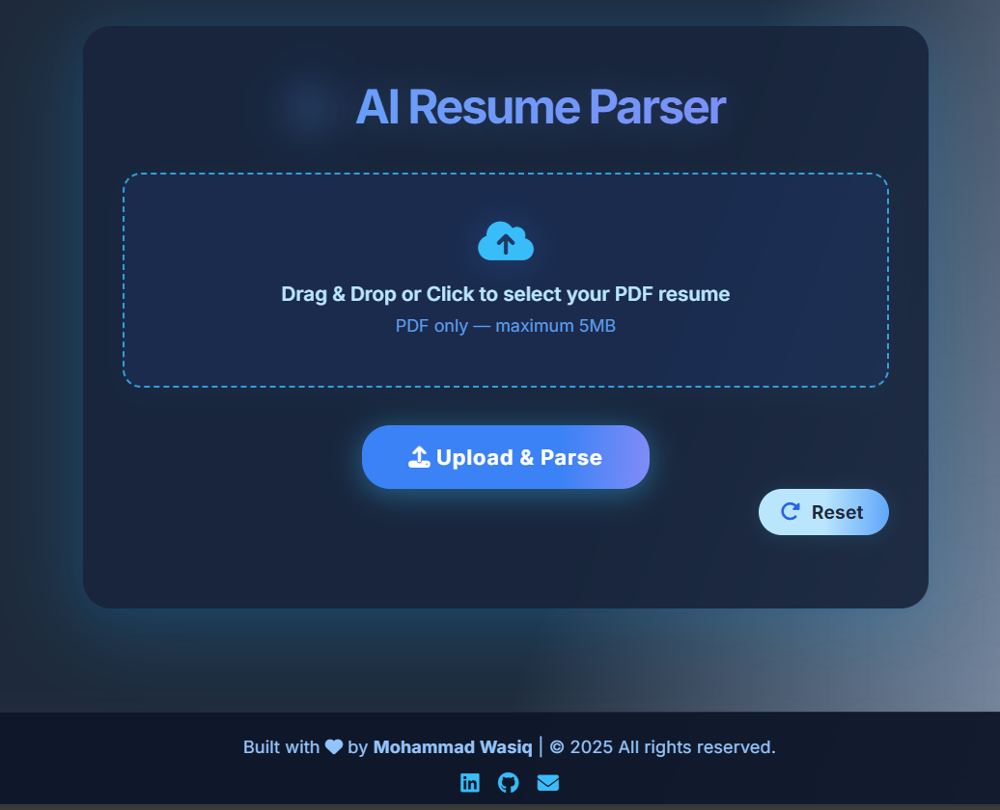

# 🧠✨ AI Resume Parser

[](https://python.org)


> **Turn PDF resumes into structured data and job recommendations in seconds, powered by Google Gemini Pro API and Python Flask, with a gorgeous UX.**

---

## ✨ Features

- 🚀 **AI-powered PDF resume parsing** with Google Gemini
- 🎨 **Modern “Glassmorphic” UI:** mobile-friendly, fixed social footer, animated colorful loader
- 🔍 Extracts _name, skills, education, jobs, certifications, languages, categories, roles_ and more
- 📡 Secure drag & drop / upload — shows file name and upload status
- 🤩 One-click reset for new resumes
- ⚡ Beautiful result cards with icons
- 💻 Tech: Python, Flask, Euri API, Bootstrap 5, FontAwesome

---


## 🖼️ Demo Screenshot


---


### **Install Python dependencies:**

```bash
python -m venv venv
source venv/bin/activate  # or .\venv\Scripts\activate on Windows
pip install -r requirements.txt
```

### **Set your EURI API Key:**

- [Get an API key from Euron.one](https://euron.one/euri)
- Create an `.env` file:

```bash
EURI_API_KEY=your-api-key-here
```

### **Run the app:**

```bash
python app.py
```

#### **Open [http://localhost:5000](http://localhost:5000) in your browser.**

---

## 🛠️ Technologies Used

- [Python 3.10+](https://python.org)
- [Flask Web Framework](https://flask.palletsprojects.com/)
- [PyPDF2](https://github.com/py-pdf/pypdf)
- [EURI API](https://euron.one/euri)

---

## 📲 Contact / Social

<div align="left">
  <a href="https://www.linkedin.com/in/mohammadwasiq0/" target="_blank" title="LinkedIn" style="margin-right:16px;">
    
  </a>
  <a href="https://github.com/mohammadwasiq0" target="_blank" title="GitHub" style="margin-right:16px;">
    
  </a>
  <a href="mailto:mohammadwasiq0786@gmail.com" target="_blank" title="Mail">
    
  </a>
</div>

---

<p align="center"><b>Built with ❤️ by Mohammad Wasiq</b></p>

---